# Integrate your Microsoft sentinel environment with Intezer

## Playbook Descriptions

### Playbook 1: UpdateIncident-IntezerAlert-Webhook
Asumming you have an running integration with Intezer ADR solution with Microsoft defender, the playbook is triggered whenever Intezer completes the alert processing. It then appends a relevant comment to the corresponding incident within Microsoft Sentinel.
### Playbook 2: Submit-IntezerAlert-IncidentTriggered
The playbook utilizes the Microsoft Sentinel incident details to generate an alert within Intezer's system.

### Playbook 3: Submit-IntezerScanFileHash-IncidentTriggered
The playbook retrieves file hashes from the Microsoft Sentinel incident, forwards them to Intezer Analyze, and appends a comment containing the resulting verdict back to the incident.

### Playbook 4: Submit-IntezerScanURL-IncidentTriggered
The playbook retrieves URL's from the Microsoft Sentinel incident, forwards them to Intezer Analyze, and appends a comment containing the resulting verdict back to the incident.

## Quick deployment
Before the deployment, make sure you going over [deployment prerequisites](#deloyment-prerequisites).

Click on the Deploy to Azure link and fill sections with the data you extracted in the prerequisites:   
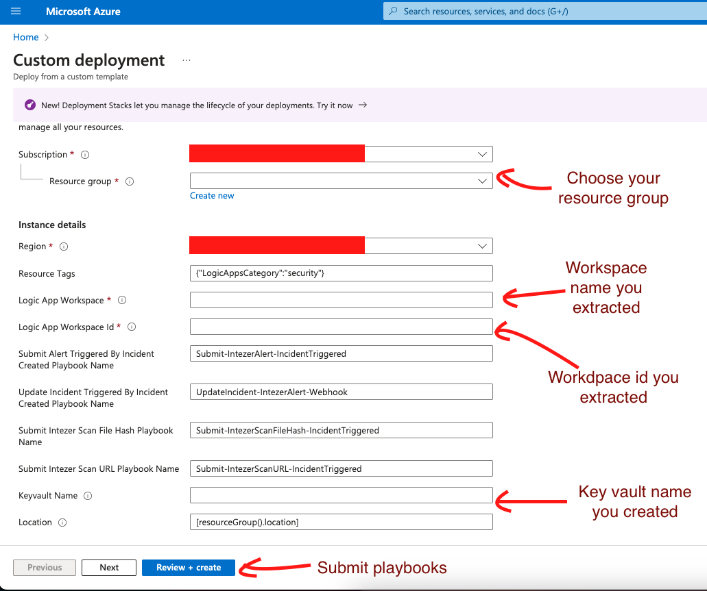

After the deployment, make sure you going over [deployment postrequisites](#deloyment-postrequisites).

### Deloyment prerequisites
1. Extracting your Microsoft sentinel **workspace name** and **workspace id** by following those steps:
    - Go to **Microsoft Sentinel** in azure portal: 
    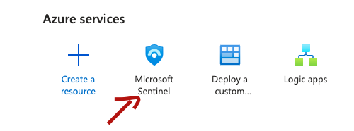
    
    - Select your Microsoft sentinel workspace: 
    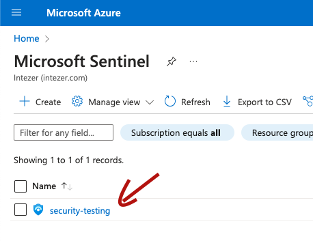
    
    - Go to **Settings**: 
    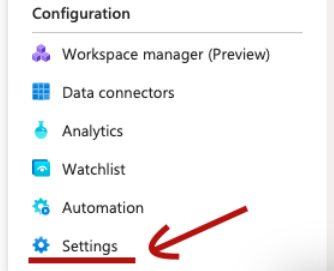

    - Select **Workspace settings >**: 
    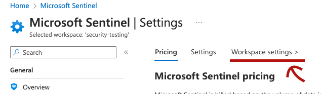

    - Under **Essentials** section you can find your workspace name and workspace id. Keep them for later usage: 
    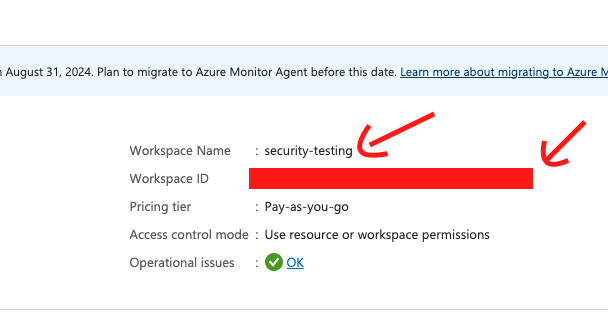

2. Set Azure vault for holding Intezer API key
    - Go to **Key vaults** in azure portal: 
    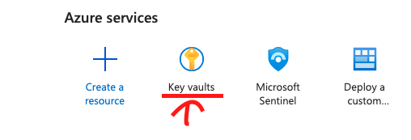

    - Create new vault, choose the unique name for **Key vault name** and keep it for later usage: 
    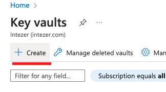
    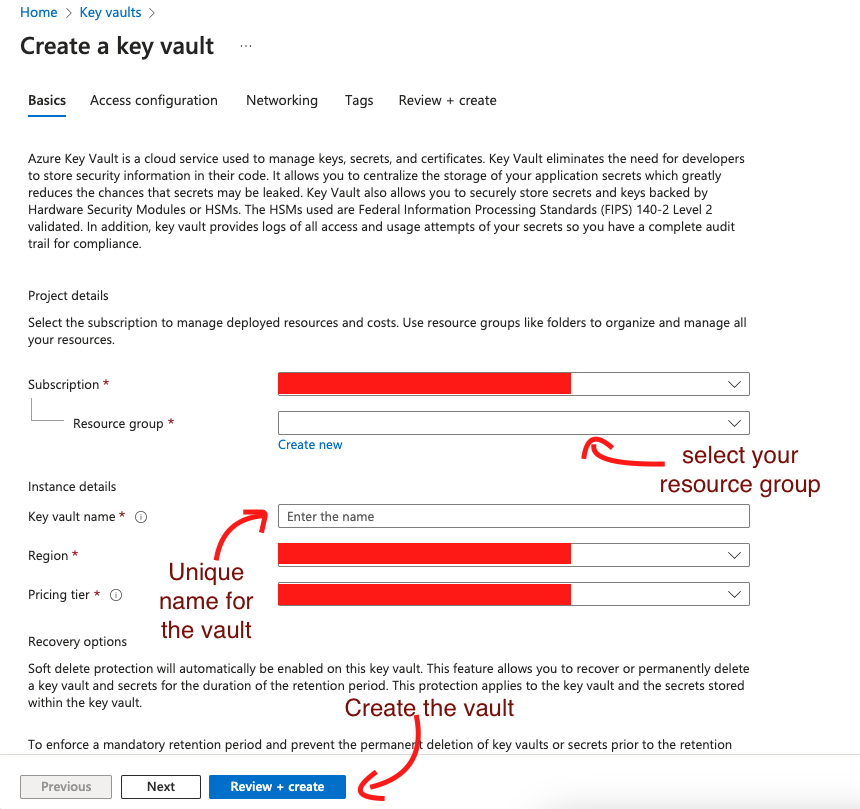

    - Go to your created vault, and create a new secret named **intezer-sentinel-api-key** for holding your Intezer API key
    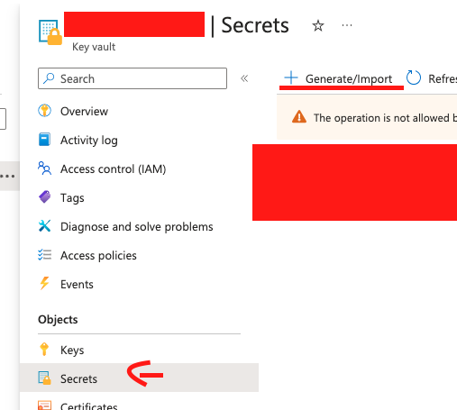
    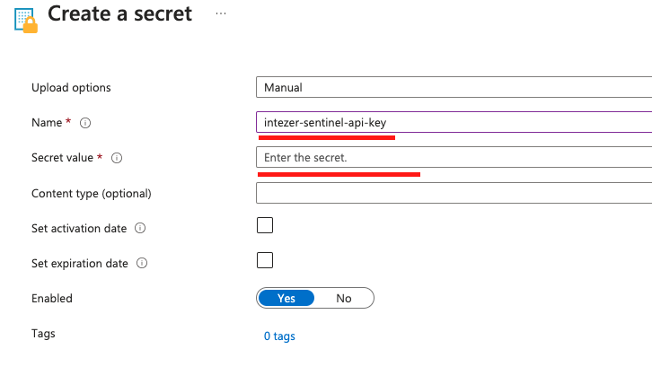
    

### Deployment postrequisites
After submitting the custom deployment, you will need to performe some actions in your azure environment

1. Give permissions to Microsoft sentinel created playbooks:
    - Go to **Microsoft Sentinel** in azure portal: 
    

    - Select your Microsoft sentinel workspace: 
    

    - Go to **Settings**: 
    

    - Select **Workspace settings >**: 
    

    - On the left manu, choose **Access control (IAM)**:
     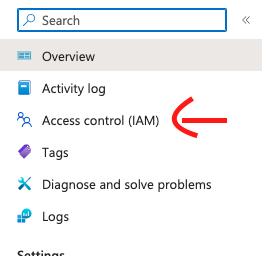

    - Click **Add** and then **Add role assignment**:
    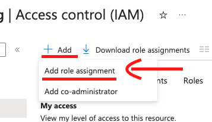

    - Under Role tab, under Job function rules tab, search and select **Microsoft Sentinel Responder** and click next:
    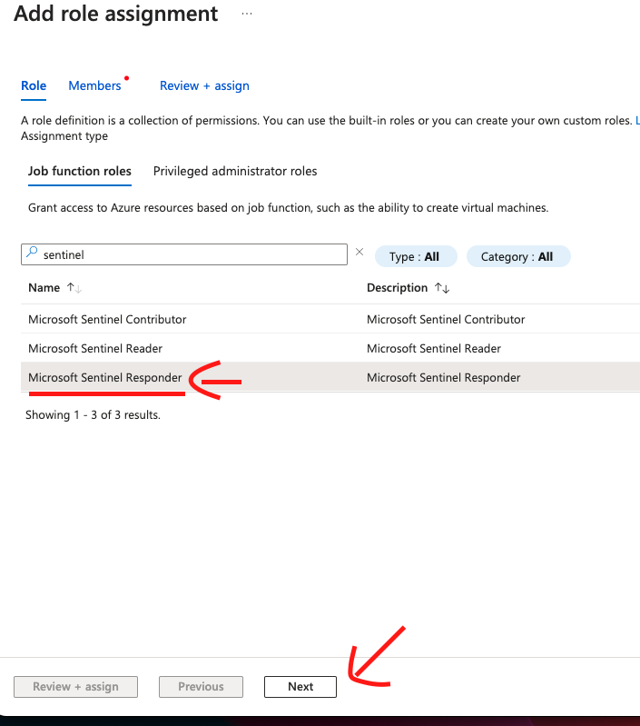

    - Click **+ Select memebers** and add the four logic app playbooks we created during deployment process, and then click **Review + assign** 
    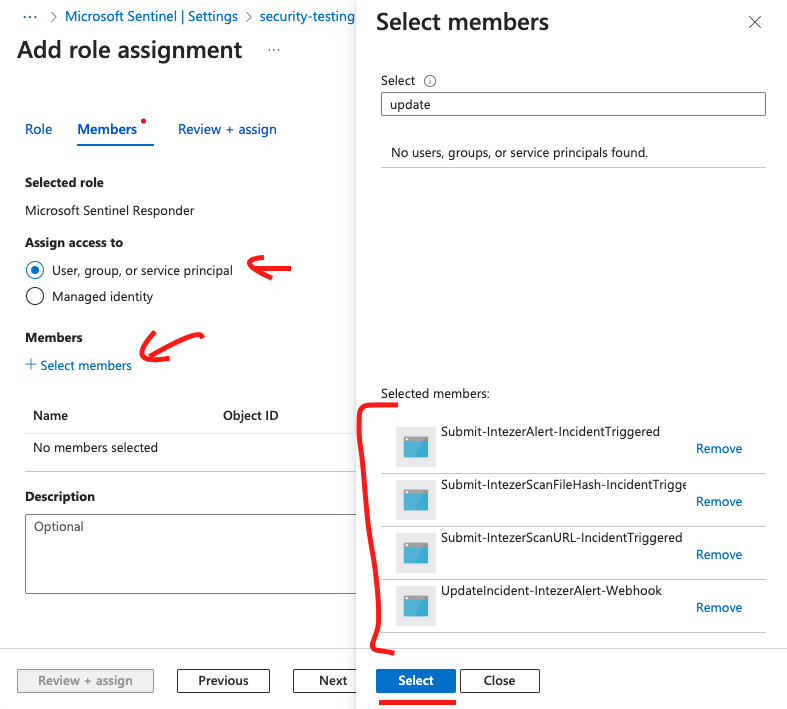
    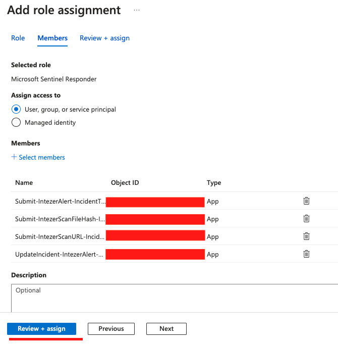

2. Give permissions to the created azure vault.

    - During prerequisites stage, you created a azure vault that holds the "intezer-sentinel-api-key". Now, after you deployed logic app playbooks, we need to make sure the vault has permissions to read secrets during a run.
    
    - Go to **Key vaults** in azure portal: 
    

    - Select your created vault from the prerequisite, in this example it will be "my-unique-vault-intezer", and choose **Access control (IAM)**
    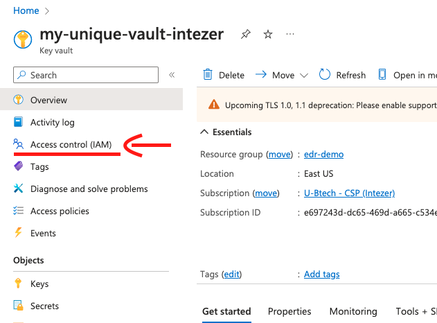

    - Click **Add** and then **Add role assignment**:
    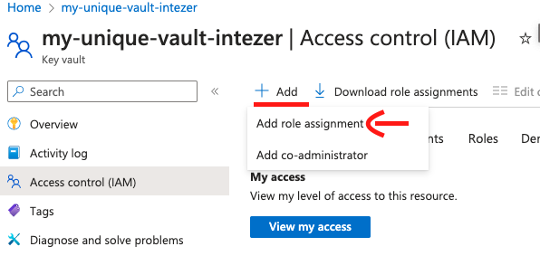

    - Under Role tab, under Job function rules tab, search and select **Key vault Reader** and click next:
    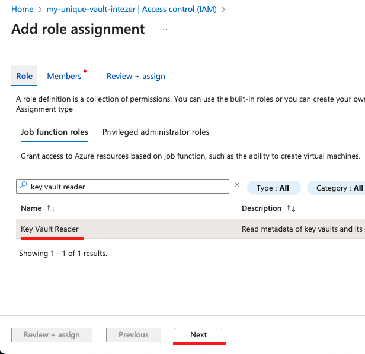

    - Click **+ Select memebers** and add the four logic app playbooks we created during deployment process, and then click **Review + assign** 
    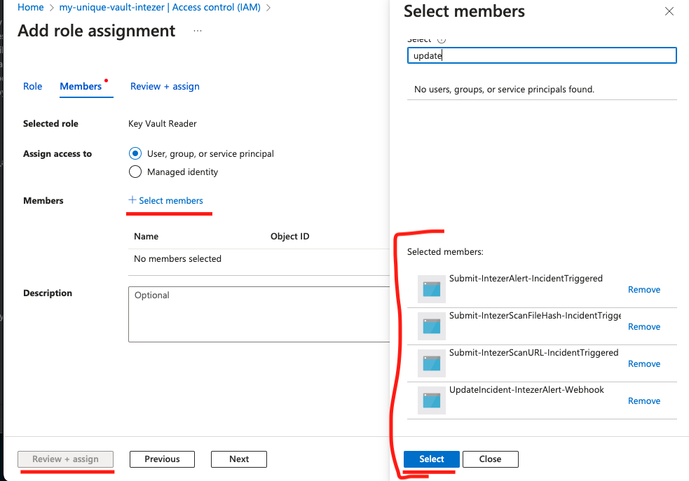

3. Enable the monitor logs API connection
    - Select **API Connections** on azure portal
    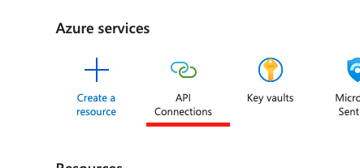

    - Search and select for **monitorlogs-intezer-connection** (it might be on Status Error)
    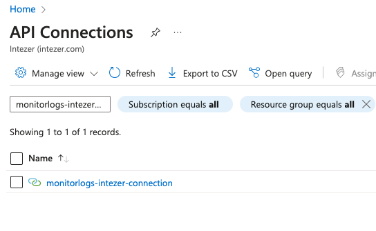

    - On the left manubar, select **Edit API connection**
    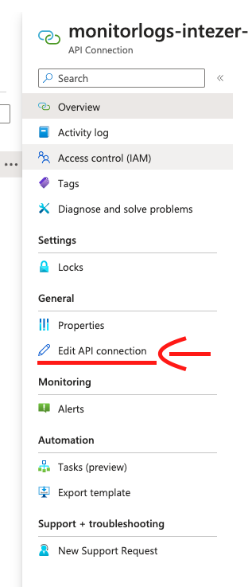

    - Authorize using your account and click Save
    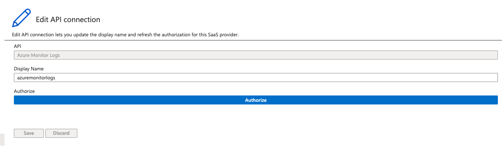

